# Mac OSX 10.11 El Capitan Sıkılaştırma

Bu döküman, Apple firması tarafından geliştirilien Mac OSX 10.11 "El Capitan" işletim sisteminin sıkılaştırılması için izlenmesinde fayda görülen adımları listelemektedir.

Herhangi bir bilgisayarın güvenliğini ve sakladığı verinin gizliliğini sağlamak için kesin bir yöntem bulunmamaktadır. Bilinen en sağlıklı yöntem; bu bilgisayarın fiziksel olarak sadece belirli kişilerin erişimine açık olması, USB gibi fiziksel medyaların bilgisayara kesinlikle bağlanmaması, bilgisayarın herhangi bir ağa dahil edilmemesi, gerekirse üzerinde yer alan ve dış dünya ile temas için kullanılabilecek donanımsal parçaların sökülmesi gibi işlemlerin gerçekleştirilmesidir. Örneğin, geçtiğimiz yıllarda gerçekleştirilen [BadBIOS](https://en.wikipedia.org/wiki/BadBIOS) isimli çalışmada bilgisayarlar arasında bir ağ bağlantısı olmasa dahi, mikrofon-hoparlör ikilisi kullanılarak bilgisayarlar arasında insan kulağının duymayacağı frekansta bir ses iletişimi kurulabileceği ve veri aktarımı yapılabileceği gösterilmiştir. Bu ve benzeri yöntemlerin araştırıldığı günümüzde, kesin bir güvenlik mekanizması geliştirilmesi pek olası görünmemektedir. Ancak bilinen saldırı yöntemlerine karşı önlem alınması ve saldırı tespiti için yöntem araştırmaktan vazgeçilmemesi gerekmektedir. Kısaca; bir bilgisayar sisteminin güvenliği, o sistemi kullanan ve yöneten kişilerin becerisine ve kabiliyetine bağlıdır.

Burada anlatılan yöntemler tek bir Mac bilgisayar kullanılarak test edilmiştir. Farklı model bir Mac bilgisayarda veya Mac OSX 10.11 "El Capitan" dışında bir sürüm işletim sisteminde denenmesi halinde bilgisayara zarar verebileceği unutulmamalıdır. Komutların ve yöntemlerin bilinçli bir şekilde uygulanması kullanıcının sorumluluğundadır.

Aşağıda kategorilere ayrılmış şekilde Mac OSX 10.11 "El Capitan" işletim sisteminin güvenliğini sağlamak amacıyla yapılabilecek işlemler listelenmektedir. Bu listede genel bazı güvenlik uyarıları yer almakta olup, daha detaylı bilgilere [Referanslar](#referanslar) kısmında yer alan kaynaklardan ulaşılabilirsiniz.

* [Genel sistem ve uygulama ayarları](#genel-ayarlar)
	* [Sistem ve uygulama güncellemeleri](#guncelleme)
	* [Bilgisayar adı (hostname)](#bilgisayar-adi)
	* [Konuk kullanıcı](#konuk-kullanici)
	* [Servis ayarları](#servis-ayarlari)
	* [Uygulamalar klasörü](#uygulama-klasoru)
	* [İmzasız uygulama engeli (Gatekeeper)](#imzasiz-uygulama)
* [Disk ve dosya sistemi ayarları](#disk-ayarlar)
	* [Full disk şifreleme (FileVault)](#full-disk-sifreleme)
	* [Firmware parolası](#firmware-parolasi)
	* [Bekleme modu ve bellek](#bekleme-modu)
	* [Parola ipuçları](#parola-ipuclari)
	* [Dosya adı uzantıları](#dosya-uzanti)
	* [Gizli dosya ve klasörler](#gizli-dosyalar)
* [Veri gizliliğini korumaya yönelik ayarlar](#gizlilik-ayarlar)
	* [Spotlight önerileri](#spotlight-onerileri)
	* [Spotlight yerelleştirme](#spotlight-yerellestirme)
	* [Arama gizliliği](#arama-gizliligi)
	* [Varsayılan dosya kayıt yeri](#varsayilan-dosya-kayit)
	* [Dosyaların metadata kayıtları](#metadata-dosya)
	* [Ekran koruyucu](#ekran-koruyucu)
	* [Tanılar ve kullanım istatistikleri](#tanilar)
* [Ağ ve bağlantı ayarları](#baglanti-ayarlar)
	* [Güvenlik Duvarı (Firewall)](#firewall)
	* [Captive portal bağlantı ayarları](#captive)
	* [Bluetooth ayarları](#bluetooth)
	* [Infrared alıcı ayarları](#infrared)
* [Çeşitli öneriler](#oneriler)
	* [Homebrew ayarları](#homebrew)

##  Denetim scripti
Bu sıkılaştırma dökümanında anlatılan adımların ve daha fazlasının yer aldığı [kristovatlas/osx-config-check](https://github.com/kristovatlas/osx-config-check) projesi üzerinde puanlama ile alakalı değişiklikler yapılarak hazırlanmıştır.

Sıkılaştırma dökümanı için hazırlanan denetim scripti [osx-config-check](osx-config-check) klasöründe yer almaktadır. Çalıştırmak için Terminal uygulamasından aşağıdaki komutun yazılması yeterlidir.

	python app.py

##  Genel sistem ve uygulama ayarları
Bu bölümde bir Mac bilgisayar kullanıcısının dikkat etmesi ve uygulaması gereken genel uyarılar yer almaktadır.

###  Sistem ve uygulama güncellemeleri
İşletim sisteminin ve cihaza yüklü olan uygulamaların düzenli olarak güncellemelerini yapmak gerekmektedir. Güncellemeler, çoğunlukla güvenlik açıklarını yamamak üzere yayınlandığından dolayı düzenli olarak kontrol edilmelidir. İşletim sistemi güncellemeri için ana ekranın sol üst köşesinde yer alan Apple logosuna tıklanarak "Bu Mac Hakkında" butonuna tıklanır.

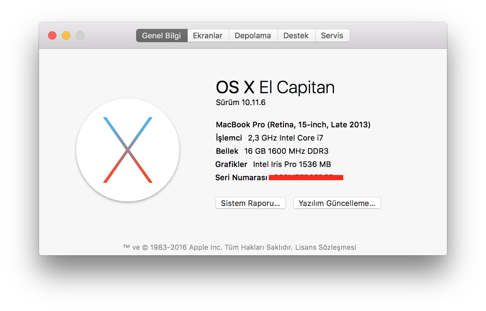

Burada yer alan "Yazılım Güncelleme..." butonuna basılarak "App Store" uygulaması üzerinden güncellemeler kontrol edilmelidir.

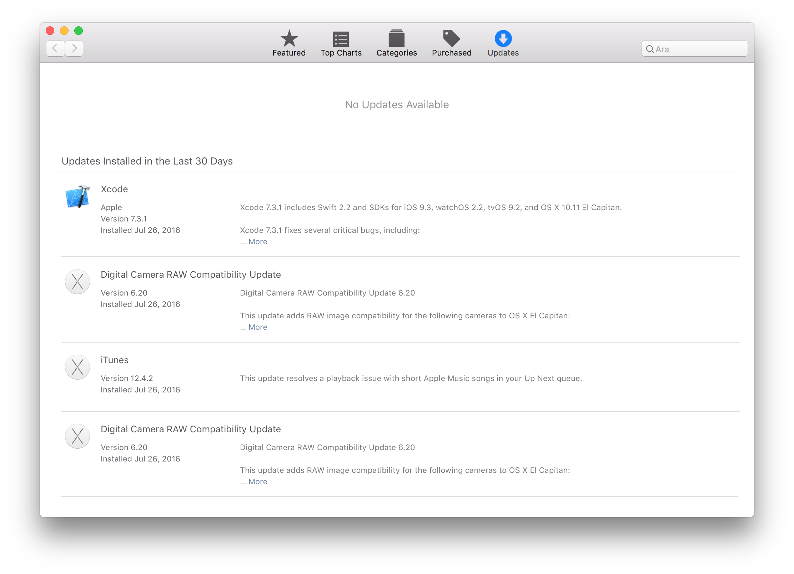

###  Bilgisayar adı (hostname)

Mac bilgisayarın ilk açılışında kurulum yapılırken kullanıcı hesap isminde isim ve soyisim gibi kimliği ortaya çıkaracak bilgilerin kullanılmaması tavsiye edilmektedir. Yazılan Bazı paylaşım servisleri, yerel ağda bilgisayarın ismini kullandığından dolayı bu durum bilgisayarın hedef olma ihtimalini artırmaktadır.

Bilgisayarın ismini, örneğin `host1567` olarak, değiştirmek için aşağıda listelenen komutlar kullanılabilir:

	$ sudo sysctl kern.hostname=host1567
	$ sudo hostname -s host1567
	$ sudo scutil --set HostName host1567
	$ sudo scutil --set LocalHostName host1567
	$ sudo scutil --set ComputerName host1567

###  Konuk Kullanıcı
Mac OS X işletim sisteminin varsyılan ayarlarında "Konuk Kullanıcı" hesabı aktif olarak gelmektedir. Sınırlandırılmış yetkilerle de olsa cihazın istenmeyen kişiler tarafından kullanılmasını engellemek amacıyla bu hesabın kapatılması tavsiye edilmektedir. 

`Sistem Tercihleri ⇒ Kullanıcılar ve Gruplar ⇒ Konuk Kullanıcı` menüsüne gidilerek `"Konukların bu bilgisayarda oturum açmasına izin ver"` işaretinin kaldırılması gerekmektedir.

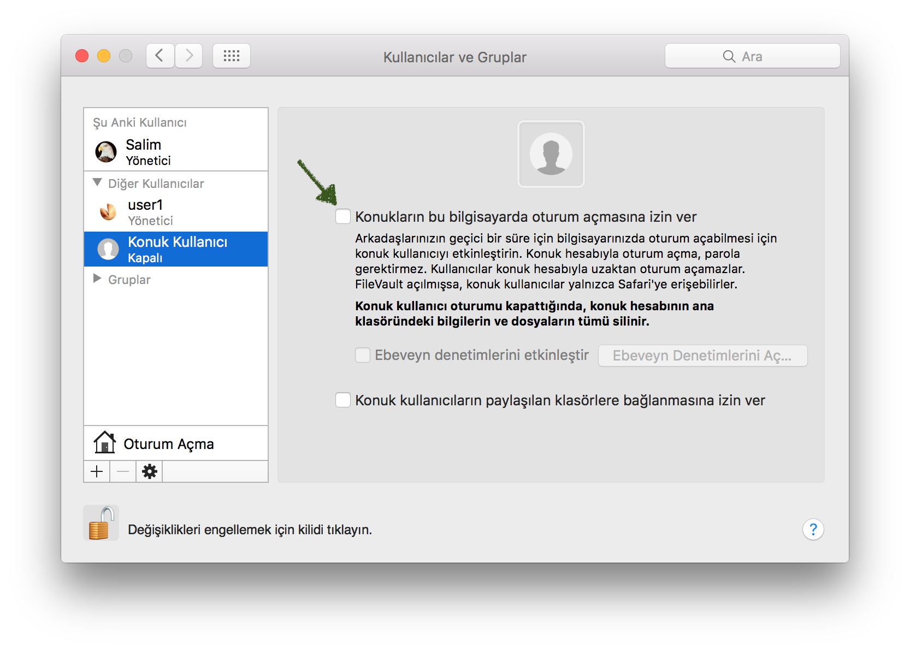

###  Servis ayarları
Mac OS X içerisinde yer alan ve işlevsel olarak sisteme bir katkısı olmadığı değerlendirilen bazı servislerin, cihaz internete bağlanmadan önce kapatılması tavsiye edilmektedir. Konu hakkında daha detaylı bilgi edinmek için [fix-macosx/yosemite-phone-home](https://github.com/fix-macosx/yosemite-phone-home) ve [l1k/osxparanoia](https://github.com/l1k/osxparanoia) sayfalarında yer alan araştırmalar incelenebilir.

Temel olarak, işletim sisteminde yer alan servisleri incelemek için aşağıdaki adımlar izlenebilir:

* Terminal uygulamasında `launchctl list` komutu ile sistemde kullanıcı profili tarafından çalıştırılan servisler görülebilir.
* Yine terminal uygulamasında `sudo launchctl list` komutu ile sistem tarafından çalıştırılan servisler görülebilir.
* İncelenmek istenen bir servis `launchctl servis.adi` şeklinde incelenebilir.
* Bu servisin hangi programları çalıştırdığı `defaults read` komutu ile `/System/Library/LaunchDaemons` ve `/System/Library/LaunchAgents` klasörlerinde yer alan plist dosyasından öğrenilebilir.
* Daha sonra çalıştırılan bu programların ne amaçla kullanıldığı Google üzerinden arama yapılarak araştırılabilir.
* Bir servisin gereksiz olduğuna veya güvenliğinizi risk altına aldığına kanaat getirdiğinizde, `sudo launchctl unload -w` komutu ile servisi devre dışı bırakabilirsiniz.

###  Uygulamalar klasörü

Mac OS X işletim sistemi ile birlikte gelen yazılımlar `/Applications/` klasöründe yer almaktadır. Dışardan yüklenen veya internetten indirilen yazılımların buraya değil, kullanıcının kendi alanında açacağı bir `Uygulamalar` klasörüne kurulması tavsiye edilmektedir. Ancak App Store üzerinden yüklenen yazılımların bu klasöre taşınmaması gerekmektedir.

###  İmzasız uygulama engeli (Gatekeeper)
Güvenilir bir anahtar ile imzalanmamış uygulamaların Mac OS X işletim sisteminde çalıştırılmaması tavsiye edilmektedir. Sadece Apple tarafından yetkilendirilmiş uygulama geliştiricilere ait uygulamarın yüklenebilmesini sağlamak için, aşağıdaki şekilde görüldüğü gibi; 

`Sistem Tercihleri ⇒ Güvenlik ve Gizlilik ⇒ Genel`

menüsüne gidilerek `Şuradan indirilen uygulamalara izin ver` kısmında `Mac App Store ve kimliği belirli geliştiriciler` seçeneği seçilmelidir.

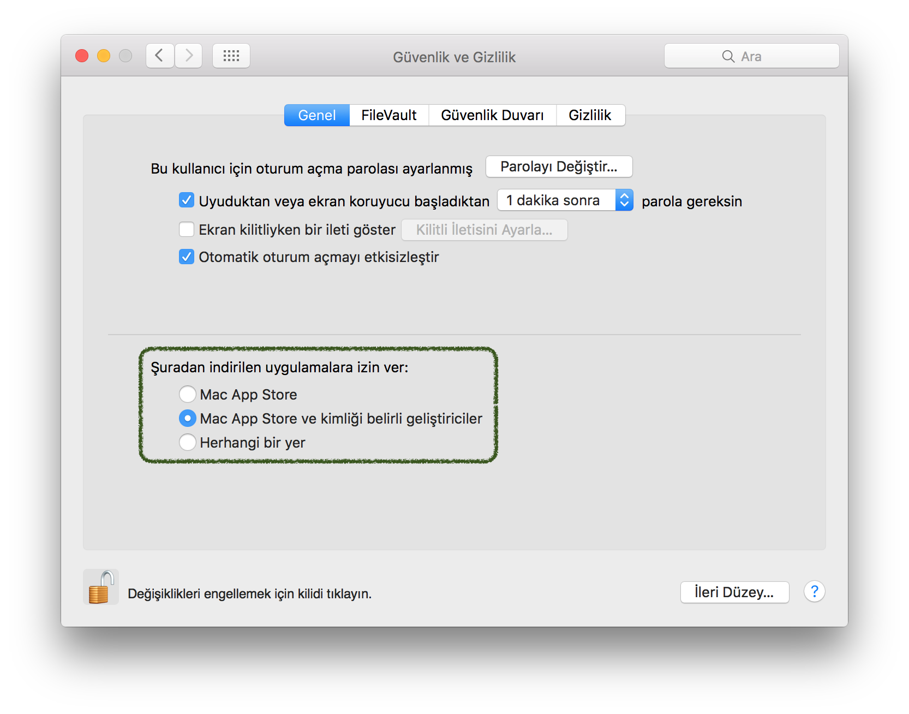

##  Disk ve dosya sistemi ayarları

###  Full disk şifreleme (FileVault)

Bilgisayarın diskinde yer alan verilerin her zaman şifreli olarak saklanması tavsiye edilmektedir. İstenmeyen kişilerin bilgisayara fiziksel olarak erişim sağlaması ve diski fiziksel olarak dışarıya çıkarması halinde, disk içerisinde yer alan veriye ulaşamaması için böyle bir önlem alınması faydalıdır. Full disk şifreleme özelliğini Apple tarafından geliştirilen `FileVault` isimli uygulama yapmakta olup, ayarlamak için aşağıdaki şekilde görüldüğü gibi; 

	Sistem Tercihleri ⇒ Güvenlik ve Gizlilik ⇒ FileVault

menüsüne gidilerek `FileVault'u aç` seçeneği seçilmelidir.

 açma")

Kurulum esnasında karşınıza çıkan `Kurtarma Anahtarı`, bilgisayarınızın parolasını unuttuğunuzda kullanabileceğiniz bir koddur. Bu kodu parolayı unuttuğunuzda erişebileceğiniz güvenli bir yerde saklamanız gerekmektedir.

###  Firmware parolası

Mac OS X işletim sistemi yüklü diskin başka bir bilgisayarda çalıştırılmasını engellemek için firmware parolası kullanılması tavsiye edilmektedir. Bilgisayarın her açılışında sorulması için de ayarlanabilmektedir. Eskiden bu parola ile korunan bilgisayarlara müdahale etmek kolayken, şimdilerde sadece Apple mağazalarında firmware parolası aşılabiliyor. Mac bilgisayarı [single-user mod](https://support.apple.com/tr-tr/HT201573) veya ayrıntılı modda başlatılmasının da önüne geçen bu parola, bilgisayarın güvenliğine katkı sağlamaktadır.

Bilgisayara firmware parolası koymak için şu adımlar izlenebilir:

* Bilgisayarı kapatık yeniden açın.
* Aynı anda `cmd` ve `R` tuşlarına basarak `Kurtarma Modu`'nu açın. Bir süre sonra `OS X Utilities` uygulaması görülecektir.
* Uygulamlar arasından `Firmware Password Utility` adlı uygulamayı açın.
* Daha sonra `Turn On Firmware Password` butonuna tıklayarak adımları takip edin.
* Tamamlandığında bilgisayarı yeniden başlatın.

Bilgisayarın açık olması halinde, firmware parolası aşağıdaki komut kullanılarak da belirlenebilir. Ancak bu şekilde belirlenen parolanın aktif olması için bilgisayarın yeniden başlatılması gerekmektedir.

	$ sudo firmwarepasswd -setpasswd

###  Bekleme modu ve bellek
Mac OS X işletim sistemi kullanan bir bilgisayar bekleme moduna alındığı zaman bellek aktif olarak erişilebilecek şekilde kaydedilmektedir. Forensik araştırmacıların bellek dökümünü almasına imkan verdiğinden dolayı, bu kayıt işleminin dondurularak yapılması için bilgisayar ayarlanmalıdır. Bilgisayar açılışını yavaşlatsa da, bu ayarlama bilgisayarda açık kalan programların ve erişim sağlanan verinin güvenliğini sağlamak amacıyla önem arz etmektedir. FileVault kullanılarak şifrelenmiş olan verinin anahtarına da bellek dökümü aracılığıyla erişilebildiği unutulmamalıdır. Dolayısıyla, bilgisayarın bekleme moduna geçtiğinde hafızayı saklama yöntemini sıkılaştırmak amacıyla aşağıdaki komut çifti çalıştırılmalıdır.

	$ sudo pmset -a destroyfvkeyonstandby 1
	$ sudo pmset -a hibernatemode 25

###  Parola ipuçları
Parola ipuçları, parolasını unutan veya hatırlamakta güçlük çeken kullanıcılara yardım etmek amacıyla kullanıcı tarafından kullanılmaktadır. Ancak aynı ipucu, saldırgan kişilerinde işini kolaylaştırmakta olup, kullanıcı parolasını denemek amacıyla oluşturulacak wordlist boyutunu önemli miktarda düşürebilmektedir. Dolayısıyla, aşağıdaki şekilde görüldüğü gibi; 

	Sistem Tercihleri ⇒ Kullanıcılar ve Gruplar ⇒ Oturum Açma

menüsüne gidilerek `Parola ipuçlarını göster` seçeneği kaldırılmalıdır.

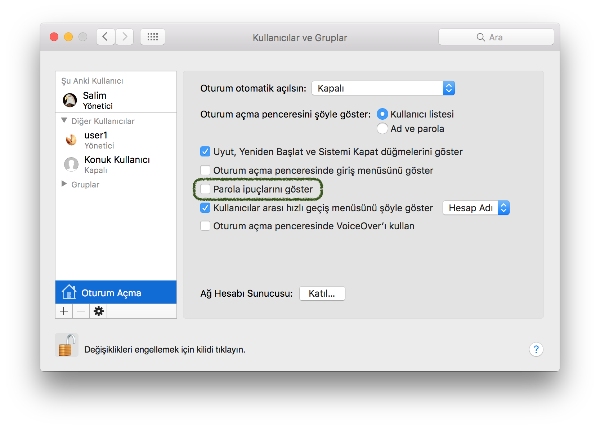

###  Dosya adı uzantıları

Özellikle Windows işletim sistemi kullanan bilgisayarlarda atak vektörü olarak kullanılan dosya uzantısı değiştirme yöntemi, Mac OS X içinde kullanılabilmektedir. Dolayısıyla, bilgisayarda görülen bütün dosyaların uzantılarını bilmek her zaman faydalı olacaktır. Bunun için `Finder` uygulaması açılarak üst menüden `Tercihler...` menüsü açılmalı ve `İleri Düzey` ayarlama sekmesinden `Tüm dosya adı uzantılarını göster` seçeneği seçilmelidir.

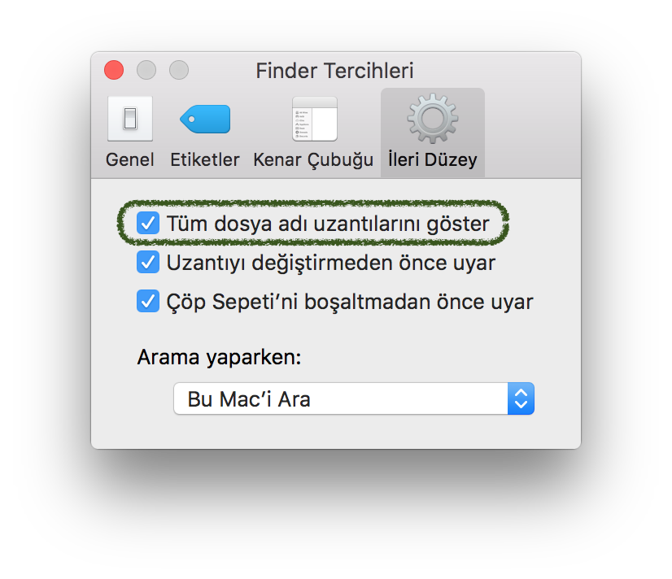

###  Gizli dosya ve klasörler
Diskin çeşitli yerlerinde kullanıcıdan saklanan dosyaların gösterilmesini sağlamak da güvenlik açısından önemli olabilmektedir. Bilgisayara bilinmeyen bir kaynak tarafından yüklenen zararlı yazılımların dosyalarını tespit edebilmek ve kullanıcının farkındalığını artırmak açısından faydalı olduğu düşünülmektedir.

	$ defaults -currentHost write /Library/Preferences/SystemConfiguration/com.apple.finder AppleShowAllFiles -bool true && killall Dock
	$ chflags nohidden ~/Library

##  Veri gizliliğini korumaya yönelik ayarlar

###  Spotlight önerileri
Mac işletim sistemi, bilgisayar içerisinde yer alan dosyaları indeksleyen ve arama kolaylığı sağlayan Spotlight isimli bir yazılım barındırmaktadır. Ancak bu yazılım yapılan aramaları Apple sunucularına göndererek kullanıcının ne tür araştırmalar yaptığını kayıt altına almaktadır. Bu durum operasyonel güvenliğe önem veren bir kullanıcı için kabul edilemez bir gerçektir, dolayısıyla yapılan aramaların sadece bilgisayarda tutulan indekslerde yapılması için aşağıdaki ayarlamaların yapılması gerekmektedir. Bunun için `Sistem Tercihleri ⇒ Spotlight` menüsüne gidilerek `Spotlight'ta ve Sözlükte Arama'da Spotlight Önerilerine İzin Ver` seçeneği kaldırılmalıdır.

Aynı menüde yer alan `Arama Sonuçları` sekmesindeki `Bing Web Aramaları` seçeneğinin kaldırılması da tavsiye edilmektedir. Yapılan araştırmalar sonucunda, Mac bilgisayar üzerinden gerçekleştirilen aramaların Microsoft Bing servisine de gönderildiği görülmüştür.

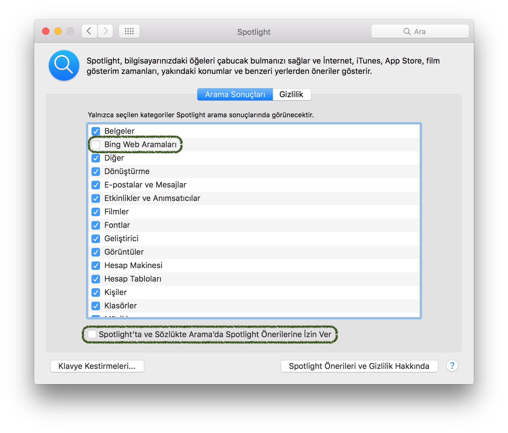

###  Spotlight yerelleştirme
Spotlight üzerinden yapılan aramaların yerelleştirilmesi ve bilgisayarın bulunduğu konuma göre önerilerde bulunulması amacıyla Spotlight uygulamasının cihazın konum bilgisine erişebildiği görülmüştür. Bu durumda, yapılan her arama ile cihazın konumu Apple sunucularına bildirilmektedir. Önüne geçmek için;

	Sistem Tercihleri ⇒ Güvenlik ve Gizlilik ⇒ Gizlilik ⇒ Konum Servisleri
	
menüsüne gidilerek, `Sistem Servisleri` ayarının yanında yer alan `Ayrıntılar...` bölümündeki `Safari ve Spotlight Önerileri` devre dışı bırakılmalıdır.

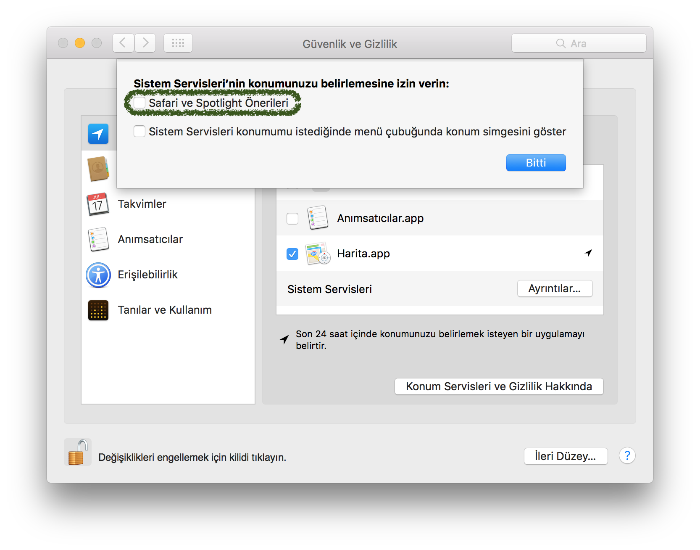

###  Arama gizliliği
Spotlight yazılımı ve benzeri yazılımlar üzerinde yapılan aramaların gizliliğini sağlamak amacıyla önerilerin yer aldığı [fix-macosx.com](https://fix-macosx.com) sitesinde yer alan python kodunun çalıştırılması, burada anlatılmayan bazı ayarların da yapılmasını sağlayacaktır.

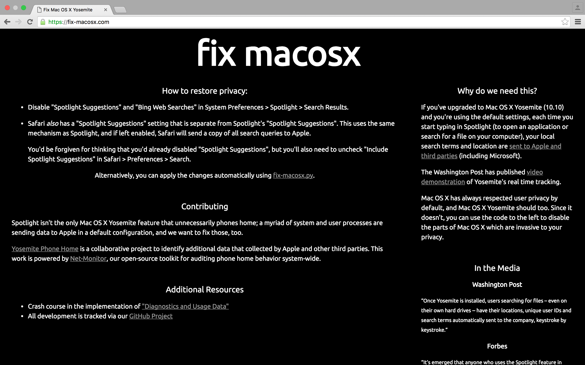

###  Varsayılan dosya kayıt yeri

Mac OS X işletim sisteminde yüklü olarak gelen birçok uygulama, başlangıç ayarlarında kaydedilen dosyaları otomatik olarak iCloud'a kaydetmeye çalışmaktadır. Bu durumda dosyanın gizliliği ortadan kalkmakta, kullanıcının hazırladığı dosyalar Apple sunucularına kaydedilmektedir. Bunun yerine dosyaları bilgisayarın diskine kaydedebilmek için, aşağıdaki komutun çalıştırılması gerekmektedir.

	$ defaults write NSGlobalDomain NSDocumentSaveNewDocumentsToCloud -bool false

###  Dosyaların metadata kayıtları
Dosya sistemi içerisinde gezinme işlemini hızlandırmak amacıyla, dosyaların metadata (oluşturulma tarihi, kim tarafından oluşturulduğu, nereden indirildiği vs.) bilgileri dosya ile birlikte kaydedilmektedir. Bu dosyalar bilgisayarın kullanıcısı olan kişi hakkında bilgi sızdırabileceğinden dolayı, .DS_Store ve AppleDouble gibi metadata dosyalarının oluşturulmasının önüne geçmek gerekmektedir.

Bilgisayar üzerinde veya ağda yer alan dosyalar için oluşturulan metadata dosyalarını önlemek için aşağıdaki komutu Terminal uygulamasına yazmak gerekmektedir.

	$ defaults write com.apple.desktopservices DSDontWriteNetworkStores -bool true

USB disklerde metadata dosyası oluşturulmasını önlemek için aşağıdaki komutu Terminal uygulamasına yazmak gerekmektedir.

	$ defaults write com.apple.desktopservices DSDontWriteUSBStores -bool true

###  Ekran koruyucu
Sadece Mac OS X için değil, diğer bütün işletim sistemlerini kullanan bilgisayarlarda ekran koruyucunun belirli bir süre sonra aktif olmasını sağlamak önemli bir güvenlik önlemidir. Mac OS X'te ekran koruyucuyu aktive etmek için aşağıdaki adımlar izlenmelidir.

	Sistem Tercihleri ⇒ Masaüstü ve Ekran Koruyucu ⇒ Ekran Koruyucu

menüsünden `Şu süreden sonra başlat:` seçeneğini uygun şekilde güncellemek gerekmektedir.

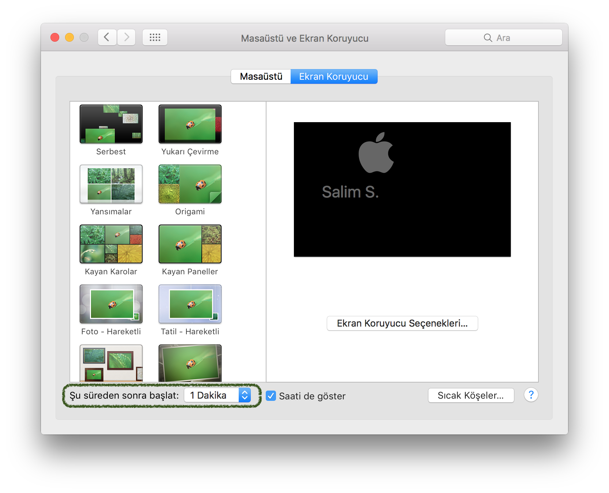

###  Tanılar ve kullanım istatistikleri
Apple tarafından Mac OS X işletim sisteminin kullanım istatistiklerini toplamak için geliştirilmiş olan bu özelliğin ne kapsamda veri topladığı bilinmemektedir. Dolayısıyla, güvenlik ve gizlilik gereği bu ayarın kapatılmasında fayda mütalaa edilmektedir.

	Sistem Tercihleri ⇒ Güvenlik ve Gizlilik ⇒ Gizlilik ⇒ Tanılar ve Kullanım

menüsünden `Tanı ve kullanım bilgilerini Apple'a gönder` seçeneğinin kaldırılması gerekmektedir.

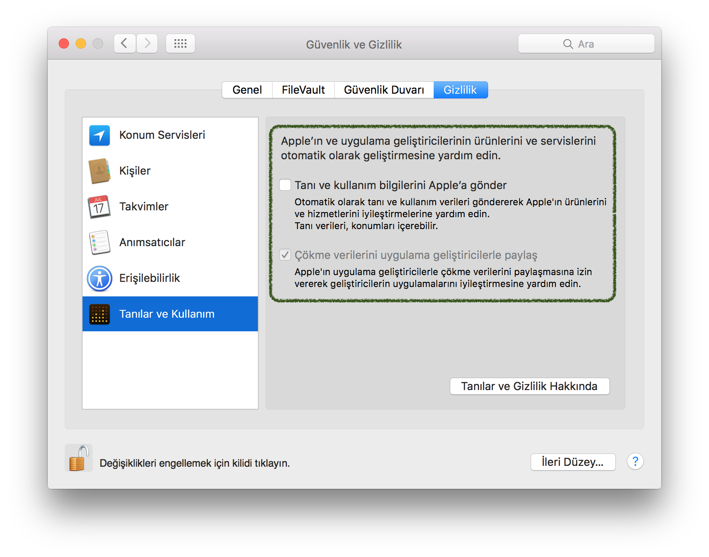

##  Ağ ve bağlantı ayarları
Mac OS X işletim sistemi temelinde ağ ve bağlantı ayarlarının güvenliğini sağlamak için önemli korumalar barındırmaktadır. Ancak bu korumaların bazıları başlangıç ayarlarında açık olmadığından dolayı, sonradan aktive edilmesi gerekmektedir.

###  Güvenlik Duvarı (Firewall)

Başlangıçta neden açık olmadığı anlaşılmasa da, Güvenlik Duvarı uygulamasının kullanıcı tarafından açılması özellikle yerel ağlarda fayda sağlayacaktır. Dışardan gelen saldırılara karşı servisleri koruyan Firewall uygulaması, eğer aynı ağdaki diğer kullanıcılara servis veren bir bilgisayar değilse bütün ayarlarıyla açılması gerekmektedir.

Bu amaçla, 

	Sistem Tercihleri ⇒ Güvenlik ve Gizlilik ⇒ Güvenlik Duvarı
menüsüne gidilerek `Güvenlik Duvarını Aç` seçeneği seçilmelidir.

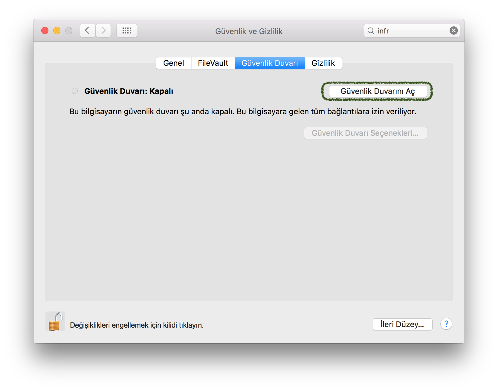

Daha sonra, `Güvenlik Duvarı Seçenekleri...` butonuna basılarak açılan pencerede, `Gelen tüm bağlantıları engelle` seçeneği seçilmelidir. Bu ayarlama sayesinde, kullanılan bilgisayara gelen tüm bağlantı istekleri engellenmiş olacaktır. Paylaşım servisleri, mesajlaşma çağrıları vs. dışardan bakan birisi için kapalı konumdaymış gibi görünecektir. Ancak kullanılan bilgisayar başka bilgisayarlara dosya paylaşımı gibi servisler veriyor ise bu ayar yapılmamalıdır.

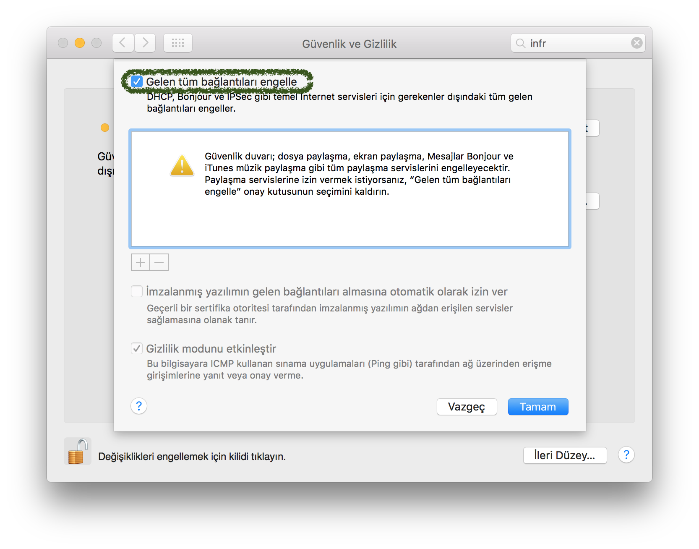

###  Captive portal bağlantı ayarları

Mac OS X işletim sistemi yüklü bir bilgisayar herhangi bir ağa bağlantı sağladığında, ağ içerisinde internet erişimi sağlayamazsa Captive Portal uygulaması ile internet erişim parolası talebinde bulunmaktadır. Özellikle otel, restoran gibi yerlerde kullanılan bu yöntem; bazı saldırı metodlarında kullanıcının çeşitli sitelerde kullandığı parolaları ele geçirmek için kullanılmaktadır. Bu sebepten dolayı captive portal bağlantı isteklerinin kaldırılması bilgisayar güvenliği için önem arz etmektedir. Captive portal bağlantısını kapatmak için;

	$ sudo defaults write /Library/Preferences/SystemConfiguration/com.apple.captive.control Active -bool false

komutu Terminal'de çalıştırılmalıdır.

###  Bluetooth ayarları

Başlangıç ayarlarında açık olarak gelen Bluetooth, kullanıcı kapatmazsa sürekli açık olmaktadır. Gerekli güvenlik kontrollerinin yapılıyor olduğu vadediliyor olsa da, kullanılmıyorsa Bluetooth'un kapatılması en ideal yoldur.

	Sistem Tercihleri ⇒ Bluetooth

menüsünden `Bluetooth'u Kapat` seçeneği ile Bluetooth özelliğinin kapatılması gerekmektedir.

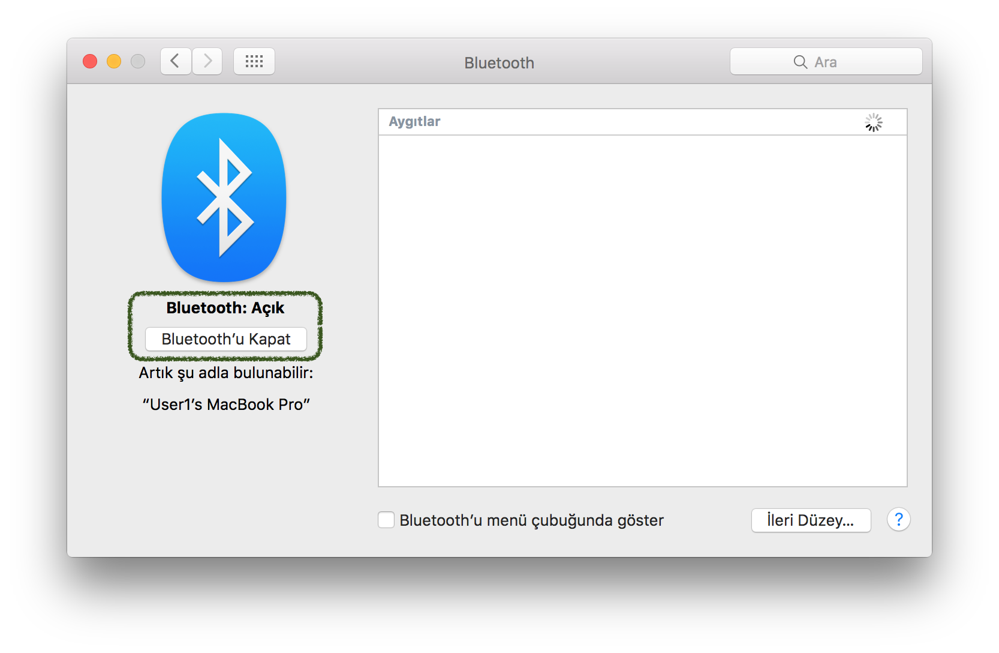

###  Infrared alıcı ayarları

Başlangıç ayarlarında açık olarak gelen Infrared alıcı, kullanıcı kapatmazsa sürekli açık olmaktadır. Medya oynatıcılarda uzaktan kumanda olarak kullanılmasını sağlamktadır. Gerekli güvenlik kontrollerinin yapılıyor olduğu vadediliyor olsa da, kullanılmıyorsa Infrared alıcının kapatılması en ideal yoldur. Kapatmak için Terminal uygulamasında aşağıdaki komut yazılmalıdır.

	$ defaults write /Library/Preferences/com.apple.driver.AppleIRController DeviceEnabled -bool false

##  Çeşitli öneriler
Bilgisayarın güvenliğini ve yazılımların güncelliğini sağlamak amacıyla aşağıdaki genel uyarıların dikkate alınması gerekmektedir.

###  Homebrew ayarları
Bilgisayarda kullanılan temel Unix yazılımlarının en güncel hallerine ulaşabileceğiniz Homebrew yazılımının yüklenmesi güvenlik açısından önemli bir adım olacaktır. Homebrew yazılımını kurmak için, Terminal uygulamasından şu komutu yazabilirsiniz:

	$ ruby -e "$(curl -fsSL https://raw.githubusercontent.com/Homebrew/install/master/install)"
	
Daha detaylı bilgilendirme için [Homebrew](https://github.com/Homebrew/homebrew/blob/master/share/doc/homebrew/Installation.md) dökümantasyonunu inceleyiniz.

##  Referanslar
Bu dökümanda yer alan yöntemlerin büyük bir çoğunluğu aşağıdaki listede yer alan projelerden ve sayfalardan faydalanılarak derlenmiştir. Bazı özel durumlar hakkında daha detaylı açıklamalarda bulunulmuştur.

* [kristovatlas/osx-config-check](https://github.com/kristovatlas/osx-config-check) adlı github projesi
* [SummitRoute/osxlockdown](https://github.com/SummitRoute/osxlockdown) adlı github projesi
* [hdrduh/OS-X-Security-and-Privacy-Guide](https://github.com/drduh/OS-X-Security-and-Privacy-Guide) adlı github projesi
* [herrbischoff/awesome-osx-command-line](https://github.com/herrbischoff/awesome-osx-command-line) adlı github projesi
* "Harden the World" topluluğunun [Mac OSX 10.11 El Capitan](http://docs.hardentheworld.org/OS/OSX_10.11_El_Capitan/) hakkında hazırladığı döküman
* [Privacy Services Manager](https://github.com/univ-of-utah-marriott-library-apple/privacy_services_manager) adlı github projesi